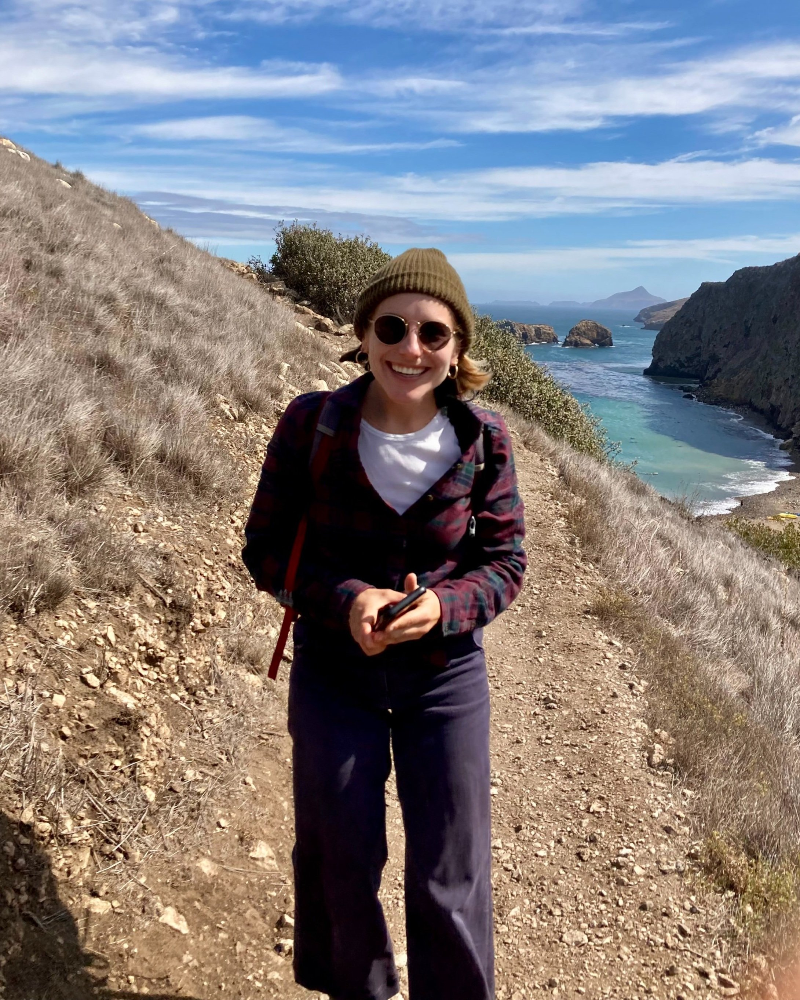
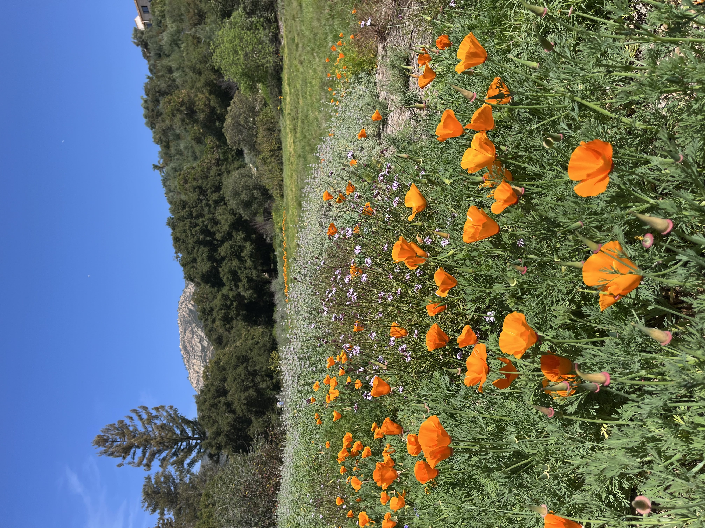
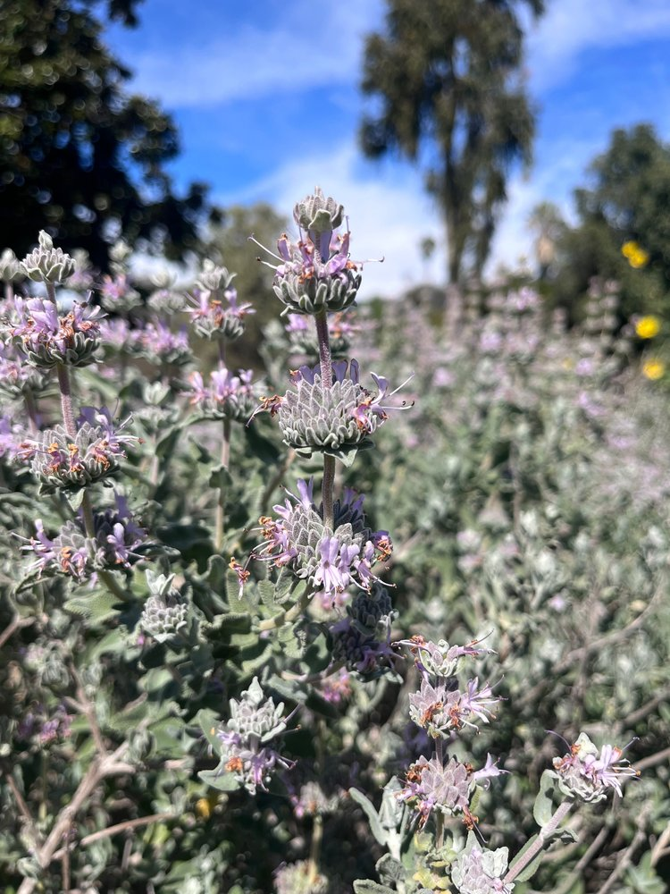
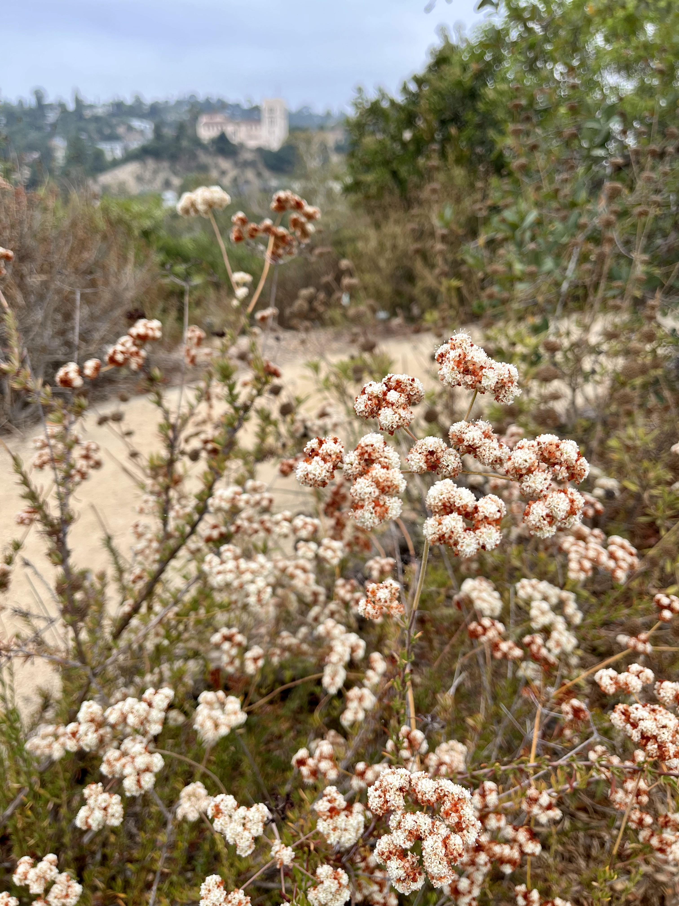

With a background in music, art, and ecology, I bring a unique blend of creativity and analytical thinking to my work in environmental science and management.

While I started my career in music (Berklee College Of Music, 2013), I pivoted into ecology soon after. With an interest in California native plants, I began volunteering with the Audobon Center and TreePeople, assisting with restoration initiatives. To build my knowledge and skills in the field, I completed a rigorous, year-long Horticulture Certification from UCLA Extension in 2020 and earned my California Native Plant Landscaper Certificate (CNPLC) in 2021. I then worked as an affiliate ecologist at Great Ecology, where I helped monitor plant establishment in wetland restoration efforts. Additionally, as Operations Manager at Fig Earth Supply Nursery, I spearheaded the Native Plant Program, promoting education and raising awareness about sustainable landscapes in urban Los Angeles.

I am currently pursuing my master's degree at the Bren School, with a focus on Energy & Climate and Conservation Planning. I am fascinated by the intersection of the built and natural environment, and have a strong interest in climate adaptation, nature based solutions, and urban systems. I'm particularly focused on sharpening my technical skills, specifically in GIS and data analysis, to address the most pressing environmental challenges.

In my free time, you can find me tending to my garden or on a hike. I also enjoy listening to old records, a good cup of coffee, and taking pictures of plants. 

::: panel-tabset
### Education

Master of Environmental Science and Management \| 2025 \| Bren School Of Environmental Science & Management at UCSB

Bachelor of Music \| Berklee College of Music

### Certifications

Leed Green Associate \| 2023

Wildfire Defense Professional (USGBC-LA) \| 2022

California Native Plant Landscaper Certificate (CNPLC) \| 2021

Horticulture (UCLA Extension) \| 2020

### Conferences

National Adaptation Forum \| 2024

California Native Plant Society Conference \| 2021
:::

::: image-grid
{width="400"}. {width="400" height="500"}
:::

::: image-grid
{width="400" height="500"}. {width="400" height="500"}
:::

