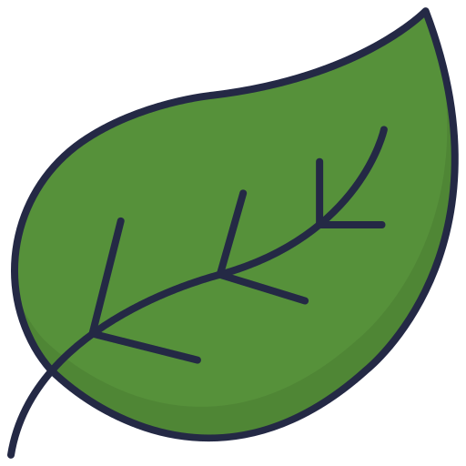

## About me

**Hi, I’m Natalie.**

I’m a scientist, musician, communicator, and crafter – usually daydreaming about climate solutions, native plants, and ways to make the [world a little greener]{style="color:#A8A36C;"}. 

I've compiled some of my recent work here. Feel free to explore and get in touch!

## Recent and Ongoing Projects

[Evaluating Ecological Conservation Gaps Across a Proposed Sentinel Landscape (Connectivity Analysis)](https://bren.ucsb.edu/projects/evaluating-ecological-conservation-gaps-across-proposed-sentinel-landscape)

[Mapping Heat-Risk Inequalities in Los Angeles County](https://plantsmith.shinyapps.io/heat_risk_inequality/)

[Quantifying the Value of Wetland Restoration](https://plantsmith.quarto.pub/natalie-smith/portfolio/benefits_transfer/)

## Professional Interests

Climate Adaptation \| Urban Biodiversity \| Environmental Justice \| Nature Based Solutions \| Sustainability \| Built Ecology

## Skill Sets

Ecology \| Data Science \| GIS \| R Programming Language \| Excel \| Project Management \| Stakeholder Engagement

## 
