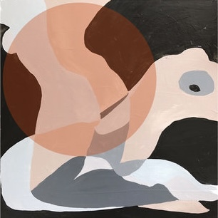

::::: grid
::: g-col-4
{fig-align="left" width="300"}
:::

::: g-col-8
Before transitioning into the environmental field, I spent 5+ years as a professional musician—creating, performing, and teaching music to a wide range of audiences. As part of **Cape Weather**, I wrote and performed original music, releasing over four EPs, including the critically acclaimed single "Telephono." I built a solid presence in the music industry through diverse performances, collaborations, strategic planning, and branding media, which led to over 3 million streams on [Spotify](https://open.spotify.com/artist/7J1pOyIKObwsdVRzu4scnI?si=7OZj4iD_QeKoNe20fi5drw). Our music has been featured on NPR, CW’s *Batwoman*, and KCRW. I’ve also performed at 100+ corporate and private events and provided background vocals for artists like Ben Folds.

While my career has since shifted to climate and sustainability—a passion that's central to my work now—I still love music and play in my free time.

Below is some music I've created over the years.
:::
:::::

 

:::: center
::: image-grid
[{width="300"}](https://capeweatherband.bandcamp.com/track/telephono-3) [{width="300"}](https://capeweatherband.bandcamp.com/track/ruin-my-day) [{width="300"}](https://capeweatherband.bandcamp.com/album/cape-weather)
:::
::::

::: image-grid
[{width="300"}](https://capeweatherband.bandcamp.com/album/slow-dance-2) [{width="300"}](https://capeweatherband.bandcamp.com/album/hunny-vol-1) [{width="300"}](https://capeweatherband.bandcamp.com/album/hunny-vol-2)
:::


