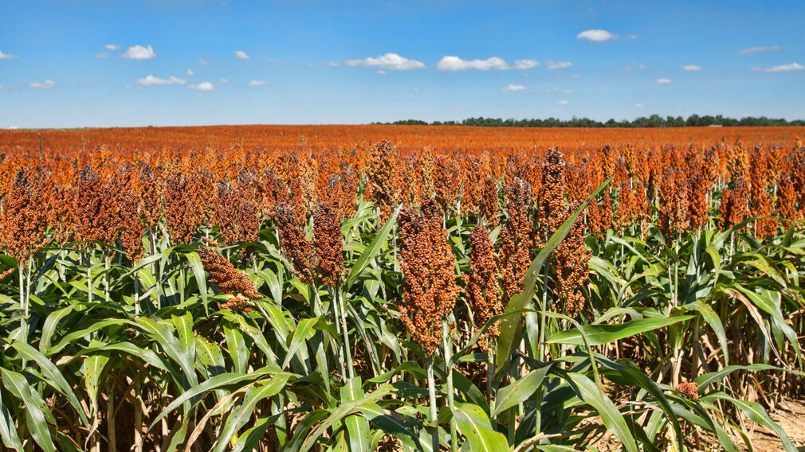

# Overview:

Farmers need to understand the biology of plants and their responses to fertilizers to maximize yield. This analysis aims to help farmers predict yields by running non-linear least squares on experimental growth data for three grains in Greece. Additionally, it assesses the response of the grains to fertilizer inputs.



```{r}
library(tidyverse)
library(knitr)
library(broom)
library(kableExtra)
library(nlraa)
library(janitor)
library(patchwork)
```

The dataset contains crop data with the following variables:

```{r}


# Create a data frame for variables
variables <- data.frame(
  Variable = c("DOY", "Block", "Input", "Crop", "Yield"),
  Description = c("Day of Year", "Location", "Irrigation & Fertilizer application (High or Low)",
                  "Type of crop: Fiber sorghum (F), Sweet sorghum (S), or Maize (M)",
                  "Biomass (Mg/ha)")
)

# Create kable table
variables_kable <- kable(variables) %>%
  kable_styling()

variables_kable

# save_kable(variables_kable, "plots/variables_kable_table.html")

```

# Write Beta Function:

After bringing in the data, and cleaning it up we need to choose a model for our NLS process. Of the 77 potential functions in the paper, we will be using the Beta function:

$$
y = ymax (1 + \frac{te - t}{te - tm})\left(\frac{t}{te}\right)^{\frac{te}{te - tm}}
$$

The parameters for the beta function are described below:

```{r}
# Access the data from SM package in NLRAA
data <- sm
#clean the data
crop_df <- data %>% 
  janitor::clean_names()
```

```{r}
# Create a data frame with the parameters
beta_parameters <- data.frame(
  Parameter = c("Y", "Ymax", "t", "tm", "te"),
  Description = c("Response variable (e.g., biomass)", "Asymptotic or maximum Y value",
                  "Explanatory variable (e.g., day of year)",
                  "Inflection point at which the growth rate is maximized",
                  "Time when Y = Yasym")
)

# Create kable table
beta_table <- kable(beta_parameters) %>%
  kable_styling()

beta_table


```

```{r}
# Create beta function:
beta<- function(ymax, te, tm, t){
  y <- ymax * (1 + (te - t) / (te - tm)) * (t / te)^(te / (te - tm))
  return(y)
}

```

# Exploratory Plot:

To find potential starting parameter values (guesses) for our NLS analysis, we created an exploratory plot showing biomass over time.

```{r}
# Plot
guess_plot <- ggplot(crop_df, aes(x = doy, y = yield, color = "data")) +
  geom_point() +
  geom_smooth()+
  facet_grid(. ~ input, scales = "free_y", space = "free_x")+
  scale_color_manual(values = c("data" = "black", "model" = "#FF5733")) +
  labs(y = "Biomass (mg/ha)", x = "Day of Year", color = " ")+
  theme_minimal()
```

```{r}
# Guesses as frames to easily inset them later
ymax_guess <- 20
te_guess <- 240
tm_guess <- 200

# Add inital guesses:
beta_test <- crop_df %>% 
  mutate(sim=beta(ymax = 20, te = 240, tm = 220, t= doy))

```

# One Crop NLS:

Next, we filter to keep the observations from only the sorghum fields (S) with high inputs (2) and run an NLS model to predict yield for any given day of the year.

```{r}
# Filter to keep observations from the sorghum fields with high inputs
crop_filter <- crop_df %>% 
  filter((crop == "S") & input == 2)

```

```{r}
nls_1 <- nls(
  formula = yield ~ beta(ymax, te, tm, doy),
  data = crop_filter,
  start = list(ymax = ymax_guess, te = te_guess, tm = tm_guess),
  trace = FALSE)

```

The following table shows selected parameter values from the NLS sorghum output, as well as a graph:

```{r}
# Create a summary table
summary_table <- coefficients(summary(nls_1))

# Basic table
cute_kable <- kable(summary_table)

# Fancy table
fancy_kable <- kable(summary_table, align = "lccc", digits = 3,
                     col.names = c("Parameter", 
                                   "Estimate", 
                                   "Standard Error", 
                                   "T-value", 
                                   "P-value")) %>%
               kable_styling()

fancy_kable 


```

```{r}
#| label: fig-one-crop
#| fig-cap: "Non-linear Least Squares with the beta function model showcasing a strong fit to the crop data."

crop_predict <- crop_filter %>% 
  mutate(predict=predict(nls_1,newdata=.))

ggplot(data=crop_predict)+
  geom_point(aes(x=doy, y=yield))+
  geom_path(aes(x=doy, y=predict),color="#FF5733")+
  labs(y = "Biomass (mg/ha)", x = "Day of Year", color = " ")+
  theme_minimal()
  
```

# Replicate the using Purrr:

We now need to run our NLS models for all 24 combinations of plot, input level, and crop type using purrr.

```{r}
#Define a new function to pass along the nls calls

all_nls <- function(test_df) {
  nls(yield ~ beta(ymax, te, tm, doy),
      data = test_df,
      start = list(ymax = ymax_guess, te = te_guess, tm = tm_guess))
}

# Replicate w Purrr
all_crops <- crop_df %>%
  group_by(block,input,crop) %>% 
  nest() %>% 
  mutate(nls_model = map(data, ~ all_nls(.x))) %>% 
  mutate(predictions = map2(nls_model, data, ~ predict(.x, newdata = .y))) %>% 
  mutate(rmse = map2_dbl(predictions, data, ~ Metrics::rmse(.x, .y$yield))) %>% 
  mutate(smooth = map(nls_model, ~predict(.x, newdata = list(doy = seq(147,306)))))

# all_crops


```

The tables below display the lowest RMSE and the best-fitted models for each species:

```{r}
# Calculate minimum RMSE for each crop
rmse_table <- all_crops %>% 
  group_by(crop) %>% 
  summarize(rmse = min(rmse))

# Filter data for crops w lowest RMSE
low_rmse <- all_crops %>% 
  filter(rmse %in% rmse_table$rmse)

# Coefficients for each crop 
low_rmse_M <- broom::tidy(low_rmse$nls_model[[1]]) 
low_rmse_S <- broom::tidy(low_rmse$nls_model[[2]])
low_rmse_F <- broom::tidy(low_rmse$nls_model[[3]])

#M Table
low_rmse_kable_M <- kable(low_rmse_M) %>%
  kable_styling()

# Add a title to the table
low_rmse_kable_M <- low_rmse_kable_M %>%
  add_header_above(c("Maize (M)" = 5))

# Display the table
low_rmse_kable_M

#S Table
low_rmse_kable_S <- kable(low_rmse_S) %>%
  kable_styling()

# Add a title to the table
low_rmse_kable_S <- low_rmse_kable_S %>%
  add_header_above(c("Sweet sorghum (S)" = 5))

# Display the table
low_rmse_kable_S

#F Table
low_rmse_kable_F <- kable(low_rmse_F) %>%
  kable_styling()

# Add a title to the table
low_rmse_kable_F <- low_rmse_kable_F %>%
  add_header_above(c("Fiber sorghum (F)" = 5))

# Display the table
low_rmse_kable_F

# # Combine data for all crops
# low_rmse_combined <- bind_rows(low_rmse_M, low_rmse_S, low_rmse_F)
# 
# # Crop to the front
# low_rmse_combined <- low_rmse_combined[, c("crop", setdiff(names(low_rmse_combined), "crop"))]
# 
# # Kable Table, Baby!
# low_rmse_kable <- kable(low_rmse_combined) %>% kable_styling()
# 
# low_rmse_kable

```

# Plot it:

To plot the data effectively, we'll:

-   Exclude maize data after day 263, as there's a noticeable dip.

-   Create new dataframes to incorporate the filtered data for each input level.

-   Filter by block 1

```{r}
# Unnest predictions from data and clean maize data
un_df <- all_crops %>% 
  filter(block==1) %>% 
  tidyr::unnest(smooth) %>% 
  mutate(doy=seq(147,306)) %>% 
  filter(!(doy>263 & crop=="M"))

# Create a dataframe to add corn data
hi_filter <- crop_df %>% 
  filter(block == 1 & input == 2)

low_filter <- crop_df %>% 
  filter(block == 1 & input == 1)

```

```{r}

# Make graphs
hi_plot <- un_df %>%
  filter(block == 1 & input == 2) %>%
  ggplot() +
  geom_point(data = hi_filter, aes(x = doy, y = yield, shape = crop)) +
  geom_line(aes(x = doy, y = smooth, linetype = crop)) +labs(y = " ", x = "Day of Year", color = " ")+
  theme_minimal()

# hi_plot


low_plot<-un_df |> 
  filter(block==1 & input==1) |> 
  ggplot()+
  geom_point(data=low_filter,aes(x=doy,y=yield,shape=crop))+
  geom_line(aes(x=doy,y=smooth,linetype=crop))+
 labs(y = " Biomass (Mg/ha) ", x = "Day of Year", color = " ")+
  theme_minimal()

# low_plot


```

```{r}
#| label: fig-two-crop
#| fig-cap: "Observed crop biomass and fitted NLS model predictions for each crop and input level in Block 1. "

#combine plots - clean up axis first 

plot1 <- hi_plot +
  ggtitle("High Inputs")

plot2 <- low_plot +
  ggtitle("Low Inputs")

combinedplot <- plot2 + plot1 +
  plot_layout(guides = "collect") +
  theme_minimal()


combinedplot
```

Results: As depicted in Figure 2, late-year biomass yield for every crop species is highest in the high input scenario, suggesting that increased irrigation and fertilizer lead to enhanced crop yields.

# Reference:

Archontoulis, S.V. and Miguez, F.E. (2015), Nonlinear Regression Models and Applications in Agricultural Research. Agronomy Journal, 107: 786-798.
