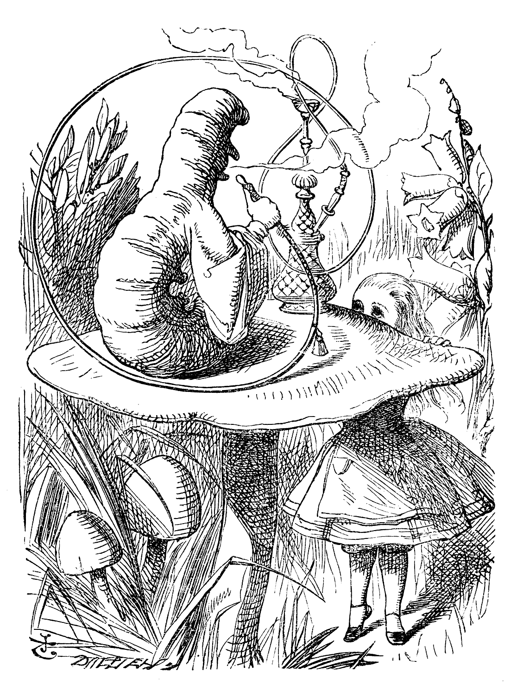

# Overview

*Alice's Adventures in Wonderland*, better known as *Alice in Wonderland*, is a novel by Lewis Carroll that follows the journey of a young girl named Alice who falls down a rabbit hole into a whimsical world. The following text analysis includes a visualization of word counts for the most frequently used words in the text, as well as a sentiment analysis.

{fig-align="center" width="374"}

# Import Libraries:

```{r}
library(tidyverse)
library(tidytext)
library(pdftools)
library(ggwordcloud)
library(here)
library(ggplot2)
library(RColorBrewer)
```

# Import and Wrangle Data:

I began by importing the book as a PDF and converting it into a dataframe. Then, I tidied the data to ensure effective organization, including chapters as variables. Next, I conducted a word count analysis by chapter, excluding common stop words and filtering out occurrences of the character name 'Alice.' To identify the top five words per chapter, I grouped the data by chapter, sorted it by word count, and extracted the top five words using slicep (1:5).

```{r}
#bring in text
alice_text <- pdftools::pdf_text(here("portfolio","alice_analysis","data","alice.pdf"))
```

```{r}
#create data frame
alice_lines <- data.frame(alice_text) %>% 
  mutate(page = 1:n()) %>%
  mutate(text_full = str_split(alice_text, pattern = '\\n')) %>% 
  unnest(text_full) %>% 
  mutate(text_full = str_trim(text_full)) 
```

```{r}
#tidy/chapters
alice_chapts <- alice_lines %>% 
  mutate(chapter = ifelse(str_detect(text_full, "CHAPTER"), text_full, NA)) %>% 
  fill(chapter, .direction = 'down') %>% 
  separate(col = chapter, into = c("ch", "num"), sep = " ") %>% 
  mutate(chapter = as.numeric((num))) %>% 
  drop_na(chapter)
```

```{r}
#words by chapter

alice_words <- alice_chapts %>% 
  unnest_tokens(word, text_full) %>% 
  filter(!word %in% c("alice", "ing"))


alice_wordcount <- alice_words %>% 
  count(chapter, word)
```

```{r}
#remove stop words
wordcount_clean <- alice_wordcount %>%
  mutate(word = str_replace_all(word, "’", "'")) %>% 
  anti_join(stop_words, by = 'word')

```

```{r}
#top5words
top_5_words <- wordcount_clean %>% 
  group_by(chapter) %>% 
  arrange(-n) %>% 
  slice(1:5) %>%
  ungroup()
```

# Top Five Words Plot:

```{r}
#| label: fig-top-words
#| fig-cap: 'Top five words per chapter in *Alice in Wonderland* after the elimination of stopwords and exclusion of the name Alice.'

# Plot top 5
library(ggplot2)

ggplot(data = top_5_words, aes(x = n, y = reorder(word,n)))+
  geom_col(fill = "#90CAF9") +
  facet_wrap(~chapter, scales = "free") +
  scale_fill_brewer(palette = "Set1") +  
  labs(x = "Frequency", y = "Word") +  
  theme_minimal() +  # Use minimal theme
  theme(
    legend.position = "none",  # Remove legend
    axis.text.x = element_text(angle = 45, hjust = 1),  # Rotate x-axis labels for better readability
    strip.text = element_text(size = 10),
    axis.text = element_text(family = "Georgia", size = 10, color = "black")) +
  scale_x_continuous(breaks = seq(0, max(top_5_words$n), by = 5))

```

# Word Cloud:

Taking it a step further, I used the cleaned word count data (excluding stopwords and occurrences of "Alice") and filtered it by chapter 8. After arranging the data by word count, I selected the top 100 words to generate a word cloud.

```{r}
ch8_top100 <- wordcount_clean %>% 
  filter(chapter == 8) %>% 
  arrange(-n) %>% 
  slice(1:100)
```

```{r}
#| label: fig-wordcloud
#| fig-cap: 'Word cloud for Chapter 8 of *Alice in Wonderland*, highlighting "Queen" as the predominant term.'

# Create the Alice palette
alice_palette <- c("#90CAF9", "hotpink", "#FFEB3B")

# Create the word cloud plot
ch8_cloud <- ggplot(data = ch8_top100, aes(label = word)) +
  geom_text_wordcloud(aes(color = n, size = n, family = "Georgia"), shape = "circle") +
  scale_size_area(max_size = 15) +
  scale_color_gradientn(colors = alice_palette) +
  theme_minimal()

ch8_cloud
```

# Sentiment Analysis:

To perform sentiment analysis, I utilized the Bing lexicon containing lists of positive, negative, and neutral words. I joined the Bing lexicon to my wrangled Alice data frame. Then, I grouped the data by chapter and sentiment and summarized, to determine the overall sentiment of the book. Finding the book to have a log ratio of -0.068 (more negative), I was curious to see the sentiment breakdown of each chapter.

```{r}
bing_lex <- get_sentiments(lexicon = "bing")

```

```{r}
alice_bing <- alice_words %>% 
  inner_join(bing_lex, by = 'word') 
```

```{r}
bing_counts <- alice_bing %>% 
  group_by(chapter, sentiment) %>%
  summarize(n = n())
```

```{r}
# find log ratio score overall:
bing_log_ratio_book <- alice_bing %>% 
  summarize(n_pos = sum(sentiment == 'positive'),
            n_neg = sum(sentiment == 'negative'),
            log_ratio = log(n_pos / n_neg))
#pivot
bing_log_ratio_book_long <- bing_log_ratio_book %>%
  pivot_longer(cols = c(n_pos, n_neg),
               names_to = "sentiment",
               values_to = "count")
#plot

# ggplot(data = bing_log_ratio_book_long, aes(x = sentiment, y = count, fill = sentiment)) +
#   geom_bar(stat = "identity", color = "white") +
#   labs(fill = "Sentiment") +
#   scale_x_discrete(labels = NULL)+
#   theme_minimal() +
#   theme(legend.position = "right") +
#   ggtitle("Sentiment Distribution") +
#    scale_fill_manual(values = c("n_pos" = "dodgerblue", "n_neg" = "gold2"),
#                     name = "Sentiment",
#                     labels = c("Positive", "Negative"))

# 728 negative, 680 positive
```

```{r}
#| label: fig-sentiment
#| fig-cap: 'Sentiment analysis by chapter reveals that despite its reputation for whimsy, *Alice in Wonderland* is characterized by negativity. Of its 12 chapters, 8 are categorized as negative.'

# Find the log ratio score by chapter: 
bing_log_ratio_ch <- alice_bing %>% 
  group_by(chapter) %>% 
  summarize(n_pos = sum(sentiment == 'positive'),
            n_neg = sum(sentiment == 'negative'),
            log_ratio = log(n_pos / n_neg)) %>%
  mutate(log_ratio_adjust = log_ratio - bing_log_ratio_book$log_ratio) %>%
  mutate(pos_neg = ifelse(log_ratio_adjust > 0, 'pos', 'neg'))

#plot
ggplot(data = bing_log_ratio_ch, 
       aes(x = log_ratio_adjust,
           y = fct_rev(factor(chapter)),
           fill = pos_neg)) +
  geom_col() +
  labs(x = 'Adjusted log(positive/negative)',
       y = 'Chapter number') +
  scale_fill_manual(values = c('pos' = '#90CAF9', 'neg' = '#FFEB3B')) +
  theme_minimal() +
  theme(legend.position = 'none',
        axis.text = element_text(family = "Georgia"),  
        axis.title = element_text(family = "Georgia")) 
```

------------------------------------------------------------------------

Carroll, Lewis. 1865. “Alice’s Adventures in Wonderland.” Dover Publications.
