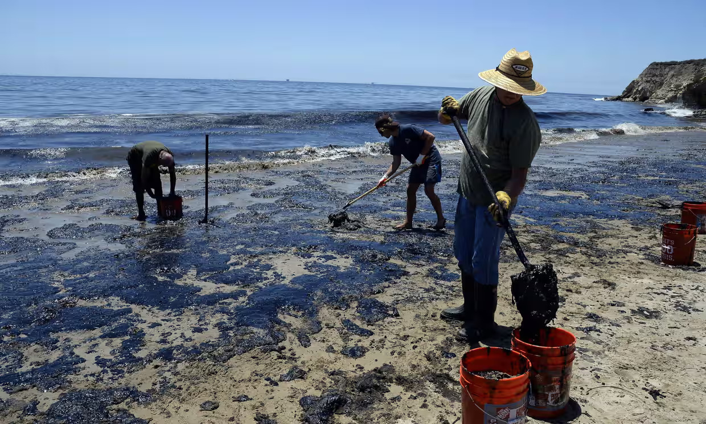

# Overview

Using the **California Department of Fish and Wildlife** Oil Spill Incident Tracking (2008) data set and California County shape files, I explored oil spill sites and spill frequency, and assessed spatial clustering. Through the visualizations provided below, it becomes clear that oil spills exhibit a pronounced level of clustering.



# Import Libraries:

```{r}
library(tidyverse)
library(here)
library(sf)
library(tmap)
library(ggplot2)
library(RColorBrewer)
library(spatstat)
```

# Import and Wrangle Data:

After importing and cleaning the data, I converted the oil spill data to a spatial object. I then dropped all coastal sites, as we are only looking at inland oil spills for this analysis. Next, I aligned both data sets by coordinate reference system.

```{r}
#bring in shapefiles
ca_counties_raw_sf <- read_sf(here('portfolio','oil_spill_analysis','data','ca_counties','CA_Counties_TIGER2016.shp'))

```

```{r}
#clean data
ca_counties_sf <- ca_counties_raw_sf %>% 
  janitor::clean_names()
```

```{r}
#bring in oil spill data
oil_df <- read.csv(here("portfolio/oil_spill_analysis/data/Oil_Spill_Incident_Tracking_[ds394].csv")) %>% janitor::clean_names() 
```

```{r}
#convert oil df to spatial:
oil_sf <- oil_df %>% 
  filter(inlandmari=="Inland") %>% 
  drop_na(x,y) %>% 
  st_as_sf(coords = c("x", "y"))

#assign CRS to oil sf
st_crs(oil_sf) <- 3857
```

# Interactive Map:

```{r}
#| label: fig-tmap
#| fig-cap: "Interactive map tracking oil spill incidents in California counties since 2008. Red dots indicate specific oil spill occurrences."

#interactive map
tmap_mode(mode = "view")

tm_shape(ca_counties_sf) +
  tm_fill(col = "white", alpha = 0.5) +  # Adjust fill color and transparency
  tm_shape(oil_sf) +
  tm_dots(size = 0.05, col = "firebrick", alpha = 0.7) 


```

# Choropleth Map:

Transitioning to static visualization, I created a choropleth map in ggplot to represent oil spill counts by county in 2008, through spatial joins and summarization.

```{r}
#spatial join
oil_ca_join <- st_join(oil_sf, ca_counties_sf) #points over counties
ca_oil_join <- st_join(ca_counties_sf, oil_sf) #counties over points --> we want this one
```

```{r}
#summarize by county
oil_counts_sf <- ca_oil_join %>% 
  mutate(county=name) %>% 
  group_by(county) %>% 
  summarize(oilcounts = n())
```

```{r}
#change name of county
#group by county and then summarize

oil_counts_sf<- ca_oil_join %>% 
  mutate(county=name) %>% 
  group_by(county) %>% 
  summarize(oilcounts = n())
```

```{r}
#| label: fig-counts-by-life-stage
#| fig-cap: "Oil spill event counts per California county, with color intensity indicating frequency occurrences. Los Angeles and San Diego counties notably have high frequencies of spills."

# Plot oil counts per county
ggplot() +
  geom_sf(data = oil_counts_sf, aes(fill = oilcounts), color = 'black', size = 1) +
  scale_fill_distiller(palette = "OrRd", direction = 1) +
  theme_minimal() +
  labs(fill = "Oil Counts") +  # Corrected function name
  theme(
    legend.title = element_text(size = 12),
    legend.text = element_text(size = 10),
    axis.text = element_blank(),
    axis.title = element_blank())+
  theme_void()
```

# G Function:

I performed a point pattern analysis to evaluate the clustering of oil spills. First, I converted the county boundaries from the original oil shape file into the observation window and merged them with the oil spill points to create a point pattern object. Next, I converted this object into a data frame and proceeded to plot the results.

```{r}
#original oil shapefile 
oil_ppp<- as.ppp(oil_sf) 
```

```{r}
#Convert county boundary to observation window
ca_counties_win <- as.owin(ca_counties_sf) 
```

```{r}
#Combine as a point pattern object (points + window):
oil_full <- ppp(oil_ppp$x, oil_ppp$y, window = ca_counties_win)
```

```{r}
# Make a sequence of distances over which you'll calculate G(r)
r_vec <- seq(0, 10000, by = 100) 
```

```{r}
gfunction_out <- envelope(oil_full, fun = Gest, r = r_vec, 
                          nsim = 100, verbose = FALSE) 
```

```{r}
#| label: fig-g-function
#| fig-cap: "Observations exhibit extreme clustering above the theoretical line (CSR), indicating significant departure from randomness."

# Convert to data frame and pivot longer
gfunction_long <- gfunction_out %>%
  as.data.frame() %>%
  pivot_longer(cols = obs:hi, names_to = "model", values_to = "g_val")

# Graph it in ggplot:
ggplot(data = gfunction_long, aes(x = r, y = g_val, group = model)) +
  geom_line(aes(color = model), size = 0.5) + 
  scale_color_brewer(palette = "Set1") + # Customize line colors
  theme_minimal() +
  labs(x = 'Radius (m)', y = 'G(r)', title = " ")
```

------------------------------------------------------------------------

[@Oil]
