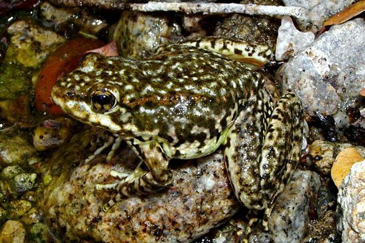

# Overview:

This analysis focuses on Mountain Yellow-legged frogs (Rana muscosa) in the southern Sierra Nevada region, utilizing data from the Sierra Lakes Inventory Project. The study aims to understand population dynamics and distribution patterns of these amphibians from 1995 to 2002.



# Part 1:

## Load Libraries:

```{r}
library(tidyverse)
library(here)
library(patchwork)
library(cowplot)
library(ggplot2)
library(dplyr)
```

## Import and Wrangle Data:

```{r}
#Import data
sierra_amph_og <- read.csv(here('portfolio/ramu/data/sierra_amphibians.csv'))
```

Data cleaning and wrangling involved several steps: first, excluding the "Egg Mass" life stage; then, removing any unnecessary data. Additionally, the date format was converted from character to the standard date format. Finally, the dataset was sorted by amphibian life stage and summarized.

```{r}
#Clean and wrangle data
ramu_only <- sierra_amph_og %>%
  filter(amphibian_species == "RAMU", amphibian_life_stage != "EggMass") %>% select(lake_id,survey_date, amphibian_species, amphibian_life_stage, amphibian_number) %>% mutate(survey_date =lubridate::mdy(survey_date),
         year = year(survey_date))

ramu_only$year <- factor(ramu_only$year)

#Sort by amphibian life stage and summarize
ramu_counts <- ramu_only %>%
  group_by(year, amphibian_life_stage) %>%
  summarize(amphibian_number= sum(amphibian_number, na.rm = TRUE)) %>% 
  ungroup()

```

## Life Stage Plot:

```{r}

#| label: fig-counts-by-life-stage
#| fig-cap: "Yellow-legged frog counts by life stage (adult, subadult, tadpole) from 1995-2002, displayed on a log10 scale for clarity. Subadults and tadpoles reached their highest counts in 2002, while adults peaked in 1997."

life_stage_bar <- ggplot(ramu_counts, aes(x = year, y = amphibian_number, fill = amphibian_life_stage)) +
  geom_bar(stat = 'identity', position = 'dodge', width = 0.7) +
  labs(x = "Year",
       y = "Number of Frogs (log10)", 
       fill = "Life Stage") +
  scale_fill_brewer(palette = "Dark2") +
  scale_y_log10(labels = scales::comma) +
  theme_minimal() +
  theme(axis.text.x = element_text(angle = 45, hjust = 1),
        legend.position = "right")

life_stage_bar
```

# Part 2:

## Refine Dataset:

The dataset underwent further filtering to focus solely on the adult and subadult life stages, while lake IDs were adjusted for improved clarity. Subsequently, a new data frame was generated to display observations of adult and subadult Mountain Yellow-legged frogs (Rana muscosa) in the five lakes with the highest overall counts.

```{r}
ramu_combined <- sierra_amph_og %>%
  filter(amphibian_species == "RAMU", amphibian_life_stage %in% c("Adult", "SubAdult")) %>%
  select(lake_id, survey_date, amphibian_species, amphibian_life_stage, amphibian_number) %>%
  mutate(
    survey_date = lubridate::mdy(survey_date),
    year = lubridate::year(survey_date),
    lake_label = paste0("Lake ", lake_id))
```

```{r}
ramu_counts_top_5 <- ramu_combined %>%
  group_by(lake_label) %>%
  summarize(amphibian_number= sum(amphibian_number, na.rm = TRUE)) %>%
  slice_max(amphibian_number, n = 5) %>% 
  arrange(-amphibian_number)

 
```

## Top 5 Lakes Graph:

```{r}
#| label: fig-top-five
#| fig-cap: "Top 5 lakes with observations of Mountain Yellow-Legged Frogs: Lake 50183 (19 observations), Lake 70583 (12 observations), Lake 10226, 41322, and 50219 (all with 11 observations)"

#| label: top-five
#| fig-cap: ""Figure 2: Top 5 lakes with observations of Mountain Yellow-Legged Frogs: Lake 50183 (19 observations), Lake 70583 (12 observations), Lake 10226, 41322, and 50219 (all with 11 observations)"

top_5_graph <- ggplot(ramu_counts_top_5, aes(x = reorder(lake_label, -amphibian_number), y = amphibian_number)) +
  geom_col(fill = "navyblue", width = 0.6) +
  labs(x = "Lake",
       y = "Observation Count") +
  theme_minimal() +
  theme(axis.text.x = element_text(angle = 45, hjust = 1)) 
top_5_graph

```

```{r}

#| label: combined-plot
#| fig-cap: "Figure 3: Analysis of Mountain Yellow-Legged Frogs (Rana muscosa) by Life Stage and Year. The left graph, displayed on a log10 scale for clarity, illustrates total counts each year across water bodies, categorized by life stage (adult, subadult, tadpole). On the right, combined counts of adult and subadult frogs in the 5 lakes with the highest totals."

plot1 <- life_stage_bar +
  ggtitle(" ")

plot2 <- top_5_graph +
  ggtitle(" ")

combined_plots <- plot1 + plot2

combined_plots


```

------------------------------------------------------------------------

Reference:

Knapp, R.A., C. Pavelka, E.E. Hegeman, and T.C. Smith. 2020. The Sierra Lakes Inventory Project: Non-Native fish and community composition of lakes and ponds in the Sierra Nevada, California ver 2. Environmental Data Initiative. https://doi.org/10.6073/pasta/d835832d7fd00d9e4466e44eea87fab3
